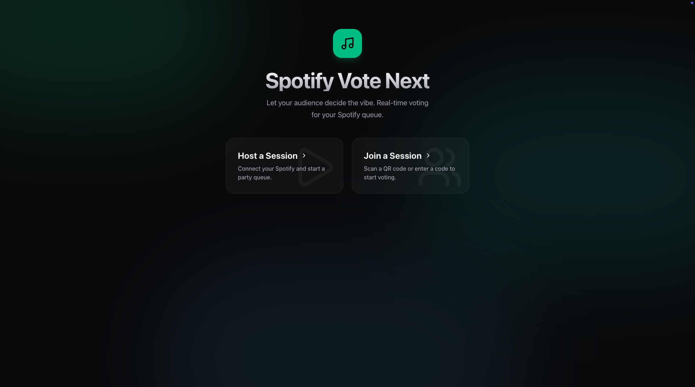
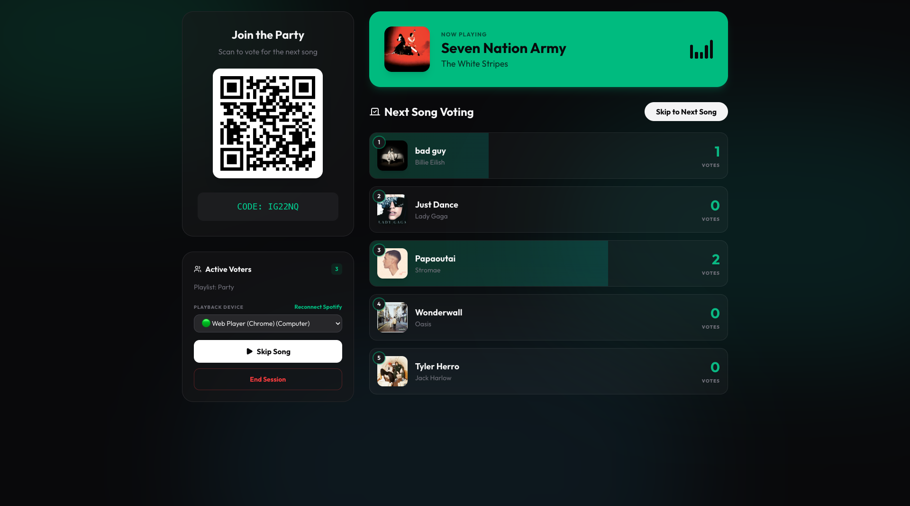
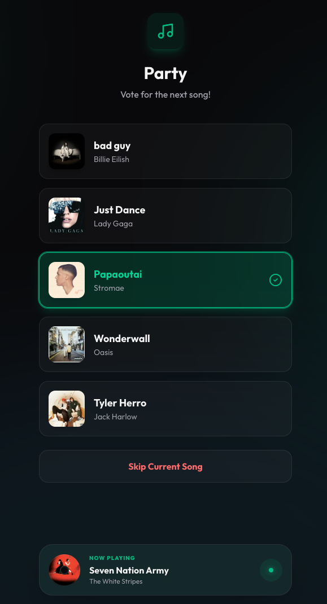

# Spotify Vote

Spotify Vote is a web application that allows a host to connect their Spotify account, select a playlist, and let guests vote on which tracks should play next. 

### What it looks like

*Caption: The user decides whether to host a session or to join one.*

*Caption: The host connects to Spotify, chooses settings of the session and the playlist, then monitors the votes.*

*Caption: The voter joins a session (by QR code or session code) then is invited to vote for a song, and has the choice to vote to skip current song.*

---

## ⚠️ Important Notice: Spotify API Restrictions

Due to Spotify's strict Web API policies, **[this specific hosted](https://musicvoter.onrender.com/) instance of the app cannot be used by the general public.**

* Newly-created apps begin in "Development mode". 
* In this mode, the app owner must have a Spotify Premium account for the app to function. 
* Most importantly, up to 5 authenticated Spotify users can use an app that is in development mode. 
* Each user who installs the app needs to be manually added to the app's allowlist before they can use it.

Because of these limits, if you want to use this application for your own parties or events, you must create your own instance by setting up your own Spotify Developer App, Firebase project, and hosting environment. 

Follow the instructions below to deploy your own version of Spotify Vote.

---

## How to Host Your Own Instance

To run this app yourself, you will need to configure three main services: Spotify, Firebase, and a hosting provider (like Render).

### 1. Spotify Setup
1. Go to the Spotify Developer Dashboard and log in.
2. Click **Create App** and fill in the App Name and Description.
3. For the **Redirect URI**, you need to add the URL where your app will be hosted, followed by `/api/auth/callback`. 
   * *Local development:* `http://localhost:3000/api/auth/callback`
   * *Production (e.g., Render):* `https://your-app-name.onrender.com/api/auth/callback`
4. Once created, go to the **Settings** tab to find your **Client ID** and **Client Secret**. Save these for later.
5. **Whitelist Users:** To allow another user to use your development mode app, log in to the Developer Dashboard, tap on the name of your app, tap on the Settings button, and then tap on the Users Management tab to add their email.

### 2. Firebase Setup
1. Go to the Firebase Console and click **Add project**.
2. Once the project is created, click the **Web** icon (`</>`) to add a Firebase Web App.
3. Register the app and copy the `firebaseConfig` object values. You will need these for your environment variables.
4. In the left sidebar, go to **Firestore Database** and click **Create database**.
5. Set up your database rules. You can use the `firestore.rules` file provided in this repository to secure your database.

### 3. Deployment on Render (or similar host)
1. Fork or clone this repository to your own GitHub account.
2. Create an account on Render and click **New+** -> **Web Service**.
3. Connect your GitHub repository.
4. Configure the build and start commands:
   * **Build Command:** `npm run build`
   * **Start Command:** `npm run start` 
5. **Environment Variables:** In the Render dashboard, add the following environment variables (refer to `.env.example` in the repo):

   **Spotify Variables:**
   * `SPOTIFY_CLIENT_ID`: Your Spotify App Client ID
   * `SPOTIFY_CLIENT_SECRET`: Your Spotify App Client Secret
   * `SPOTIFY_REDIRECT_URI`: `https://your-app-name.onrender.com/api/auth/callback`
   
   **App Variables:**
   * `SESSION_SECRET`: A random string of characters used to secure browser sessions.
   * `GEMINI_API_KEY`: *(Only required if you are using AI features)*
   
   **Firebase Variables:**
   * `VITE_FIREBASE_API_KEY`
   * `VITE_FIREBASE_AUTH_DOMAIN`
   * `VITE_FIREBASE_PROJECT_ID`
   * `VITE_FIREBASE_STORAGE_BUCKET`
   * `VITE_FIREBASE_MESSAGING_SENDER_ID`
   * `VITE_FIREBASE_APP_ID`
   * `VITE_FIREBASE_MEASUREMENT_ID`
   * `VITE_FIREBASE_FIRESTORE_DATABASE_ID`

6. Click **Deploy**. Once the deployment is finished, your app will be live and ready to use!

### Local Development
If you want to run the app locally to make modifications:
1. Clone the repository.
2. Run `npm install`.
3. Copy `.env.example` to a new file named `.env` and fill in all the variables.
4. Run the development server using `npm run dev`.
